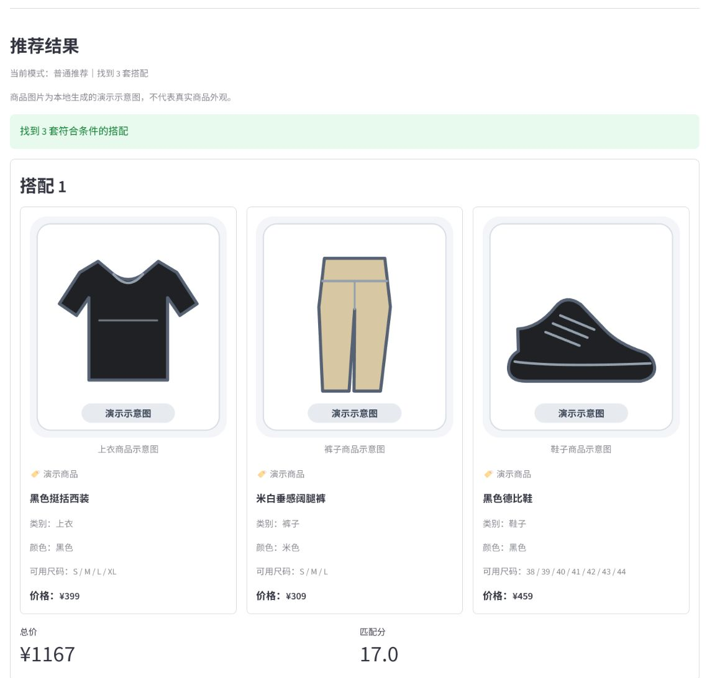
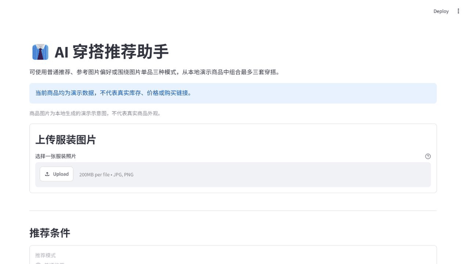
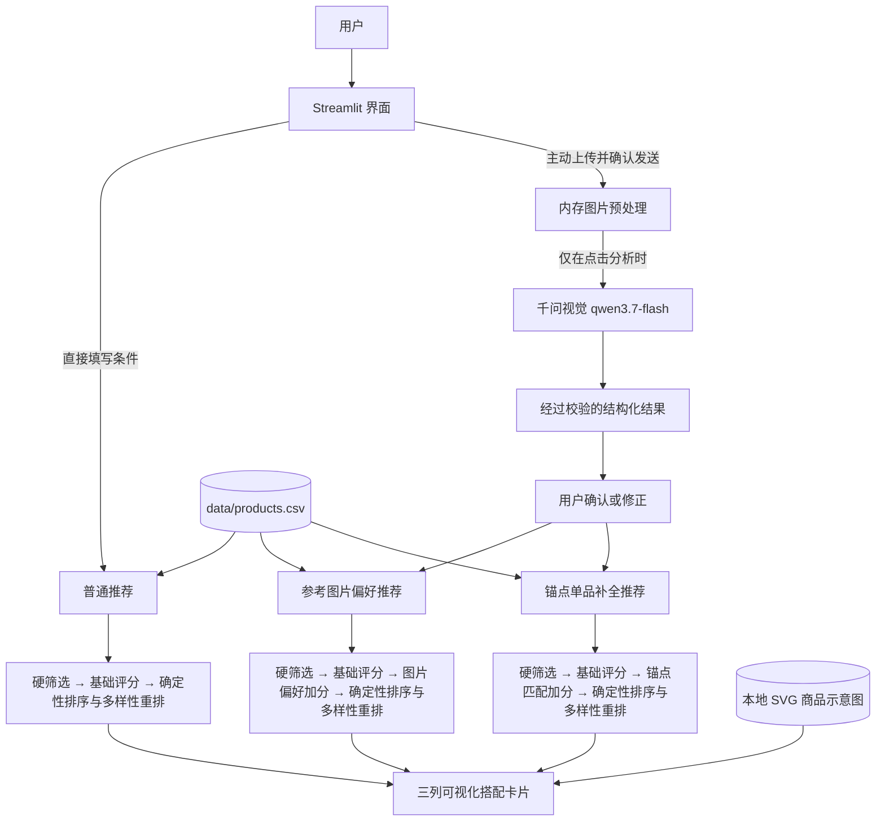

# AI 穿搭推荐助手

> 一个把可选的多模态图片理解与确定性商品推荐结合起来的中文 Streamlit MVP。

[中文产品案例](docs/PRODUCT_CASE_STUDY_ZH.md)

**在线体验：** 仓库公开元数据未提供可核验的部署 URL，因此这里不放置未经确认的链接。



**技术栈：** Python · Streamlit · OpenAI Python SDK · 千问 `qwen3.7-flash` · Pillow · CSV · Pytest · SVG

这是一个可运行、可测试、已部署的 MVP：用户可以直接按条件推荐，也可以在主动分析图片并确认结果后，使用图片偏好排序或围绕自有单品补全穿搭。项目不是虚拟试穿，不生成真人穿着效果图。

## 要解决的问题

穿搭推荐同时包含两类不同的问题：预算、尺码等条件必须严格满足；颜色与风格偏好则更适合影响候选顺序，而不是把可行商品全部删除。若直接让模型生成商品，还会出现虚构库存、价格和不可复现结果。

本项目因此采用“**视觉模型负责理解图片，规则推荐器负责选择真实商品**”的边界：所有推荐商品都来自本地 CSV，硬约束先过滤，软偏好再加分，最终结果以确定性规则排序并进行多样性重排。

## 三种推荐模式

| 模式 | 用户输入 | AI 的角色 | 推荐结果 | 生成搭配时新增 AI 调用 |
| --- | --- | --- | --- | --- |
| 普通推荐 | 场景、预算、尺码、风格、排除颜色 | 不参与 | 从 CSV 组合上衣、裤子和鞋子 | 否 |
| 参考图片偏好 | 一张服装图片 + 用户确认的主色与风格 | 仅把图片理解为结构化字段 | 图片偏好作为软加分，仍推荐 CSV 三件套 | 否；只有用户主动点击图片分析时调用一次，命中会话缓存时不调用 |
| 围绕图片单品 | 一张单品图片 + 用户确认的名称、类别、主色与风格 | 仅把图片理解为结构化字段 | 把自有单品作为锚点，从 CSV 补齐另外两个类别 | 否；生成搭配不会再次调用模型 |

## 核心能力

- 24 条明确标注的演示商品，覆盖上衣、裤子和鞋子。
- 预算、尺码、场景、表单风格与排除颜色均为硬约束。
- 基础匹配评分、可选图片偏好加分与确定性多样性重排。
- JPG、JPEG、PNG 上传；EXIF 方向修正、最长边压缩和内存内 JPEG 转换。
- 千问视觉结果的 JSON 解析、字段类型与范围校验，以及面向用户的错误分类。
- 图片分析结果必须经过用户确认，模型原始标签不会直接进入推荐器。
- 自有锚点不伪装成商品、不计入采购预算，也不展示虚构价格或库存。
- 24 张本地生成 SVG 商品示意图、三列搭配卡片与安全占位图降级。
- 同图同模型的会话缓存、每会话最多分析 3 张不同图片，控制重复调用成本。

## 用户操作流程

普通推荐不依赖 AI 服务：打开页面后直接填写条件并点击“生成穿搭”即可。图片模式采用显式授权与确认流程：

1. 可选上传 JPG、JPEG 或 PNG 图片。
2. 阅读隐私提示、勾选确认后，主动点击“AI 分析服装”。
3. 查看结构化分析结果，确认或修正主色、风格或锚点单品字段。
4. 选择对应推荐模式，填写同一套硬约束条件。
5. 点击“生成穿搭”；推荐器只读取已确认字段和本地商品库，不会再次调用视觉模型。



## 系统架构



普通模式完全绕过图片处理与视觉模型。千问只参与图片理解；商品选择、价格计算、排序和理由生成均由本地确定性代码完成。确认偏好、确认锚点、调整条件和生成搭配都不会重复调用模型。

## 推荐逻辑：硬约束与软评分分离

### 硬约束

- 商品必须真实存在于 `data/products.csv`。
- 总价不得超过预算；锚点模式只计算需要购买的两个 CSV 商品。
- 上衣与裤子按对应尺码过滤；锚点模式在需要购买鞋子时额外应用鞋码。
- 商品必须满足用户选择的场景与表单风格。
- 被排除颜色不能出现在待推荐的 CSV 商品中。
- 锚点所属类别不会再次从 CSV 推荐，自有单品本身不受排除颜色影响。

### 软评分与重排

- 基础分综合合法组合的预算利用、颜色多样性与场景/风格标签丰富度。
- 图片偏好或锚点主色命中同色时获得较高加分，命中明确协调色时获得较低加分。
- 用户确认的图片或锚点风格与商品标签一致时获得加分；表单风格仍然是硬筛选。
- 图片偏好加分和锚点加分都有上限，只改变合法候选的排序，不突破硬约束。
- 候选先按最终分、价格和商品 ID 确定性排序，再贪心选择与已选结果重复商品最少的搭配；候选不足时允许复用，保证不减少原本可返回的结果。

相同输入始终得到相同结果，推荐器不使用随机数，推荐理由也只来自实际命中的规则。

## 七个关键设计决策

1. **确定性推荐核心。** 商品与价格均来自 CSV，避免模型虚构商品，也便于回归测试。
2. **AI 输出先校验、再由用户确认。** 原始标签不会直接影响推荐，用户修改值拥有最终优先级。
3. **硬约束与软偏好分层。** 可行性由规则保证，图片信息只在合法候选之间改变顺序。
4. **按需调用和会话级缓存。** 只有主动点击分析才产生请求，同图同模型只分析一次，并限制每会话不同图片数量。
5. **图片只在内存中处理。** 原图和压缩图不写入磁盘、数据库或仓库，也不记录 Base64。
6. **排序后做多样性重排。** 在保留高分结果的同时，尽量减少前三套中上衣、裤子和鞋子的重复。
7. **本地可控的视觉资产。** 商品示意图由标准库脚本确定性生成，不依赖远程图片 URL，缺失时安全回退到本地占位图。

## 隐私、安全与成本控制

- 上传图片在当前进程内完成方向修正、缩放和压缩，仅在用户确认并点击分析后临时发送至阿里云百炼。
- 会话缓存只保存结构化分析结果，不保存图片内容；不同会话不共享缓存。
- API Key 与 Workspace ID 只从 `.streamlit/secrets.toml` 读取，该文件已被 `.gitignore` 排除。
- 源码、文档、测试与日志不包含真实凭据，也不会输出图片 Base64、完整上游异常或服务地址细节。
- 最多重试 1 次、约 30 秒超时、低温度和输出 Token 上限共同限制单次请求成本。
- AI 服务未配置或不可用时，普通推荐仍可独立运行。

## 测试与验证

当前测试套件共 **120 项通过**，覆盖以下类别：

- CSV 读取、预算、尺码、场景、风格、排除颜色与商品来源。
- 基础排序、图片偏好软加分、推荐理由、确定性与多样性重排。
- 标签和锚点类别映射、用户确认状态、图片切换隔离。
- 图片 EXIF、缩放、Base64、严格 JSON 校验、错误分类、会话缓存与 3 图限制。
- 三种推荐模式回归兼容与“确认/生成不会触发额外 API”。
- 24 个 SVG 的存在性、XML 可解析性、安全限制、路径穿越防护与占位图降级。
- 三列商品卡片、锚点内存预览及无远程图片请求。

测试通过依赖注入和模拟响应隔离网络，不会真实调用千问。仓库当前未配置 GitHub Actions，因此这里不宣称 CI 状态。

## 本地运行

需要 Python 3.10 或更高版本。

```bash
git clone https://github.com/ikuta46xie/outfit-recommender-mvp.git
cd outfit-recommender-mvp
python -m venv .venv
```

激活虚拟环境：

```powershell
# Windows PowerShell
.\.venv\Scripts\Activate.ps1
```

```bash
# macOS / Linux
source .venv/bin/activate
```

安装并启动：

```bash
python -m pip install -r requirements.txt
python -m streamlit run app.py
```

普通推荐无需任何 Secrets。若需要可选的千问图片分析，复制占位配置并填写自己的值：

```toml
# .streamlit/secrets.toml
[qwen]
api_key = "YOUR_API_KEY"
workspace_id = "YOUR_WORKSPACE_ID"
model = "qwen3.7-flash"
```

不要提交 `.streamlit/secrets.toml`。运行测试与重新生成商品 SVG：

```bash
python -m pytest
python scripts/generate_product_assets.py
```

## 项目结构

```text
.
├── app.py                       # Streamlit 界面、会话状态与结果卡片
├── recommender.py               # 普通与图片偏好推荐
├── anchor_recommender.py        # 锚点单品补全推荐
├── vision_analyzer.py           # 图片预处理、千问调用与结果校验
├── image_preferences.py         # 颜色/风格标准化与协调色规则
├── anchor_item.py               # 锚点数据结构、映射与会话绑定
├── product_visuals.py           # 本地商品图安全映射与占位图
├── data/products.csv            # 24 条演示商品
├── assets/products/             # 24 张 SVG 与占位图
├── scripts/generate_product_assets.py
├── tests/                       # 120 项自动化测试
└── docs/                        # 产品案例与演示素材
```

## 版本演进

| 版本 | 已验证的增量 |
| --- | --- |
| V0.1 | 中文 Streamlit MVP、24 条 CSV 演示商品、硬筛选与基础评分；随后补充确定性多样性重排 |
| V0.2 | 图片上传与受限宽度预览；图片尚不参与推荐 |
| V0.3 | 接入 `qwen3.7-flash` 视觉分析、严格结构化校验、会话缓存与费用保护 |
| V0.4 | 用户确认主色/风格后进行图片偏好软排序，普通推荐保持兼容 |
| V0.5 | 把用户自有上衣、裤子或鞋子作为锚点，补齐另外两个类别 |
| V0.6 | 本地生成商品 SVG、三列可视化搭配卡片与缺图安全降级 |
| V0.7 | 求职作品集文档、架构说明与演示材料完善。 |

## 当前限制与下一步

- 商品库仍是 24 条演示数据，不包含真实库存、购买链接或实时价格。
- 图片分析针对服装理解，不保证对复杂多人、多件遮挡或低质量图片准确。
- 风格与颜色协调规则是可解释的有限规则集，不代表完整审美判断。
- 项目不是虚拟试穿，也不生成真人穿着效果图。
- 当前没有登录、数据库、跨会话偏好或真实电商数据接入。

下一阶段优先进行真实用户验证，计划观察任务完成率、首次可用推荐率、推荐采纳意向、图片分析失败率和单会话模型调用次数；这些都是**待验证指标**，不是当前已取得的业务数据。随后再根据证据决定是否扩充商品库、引入持久化、优化规则或增加可观测性。
